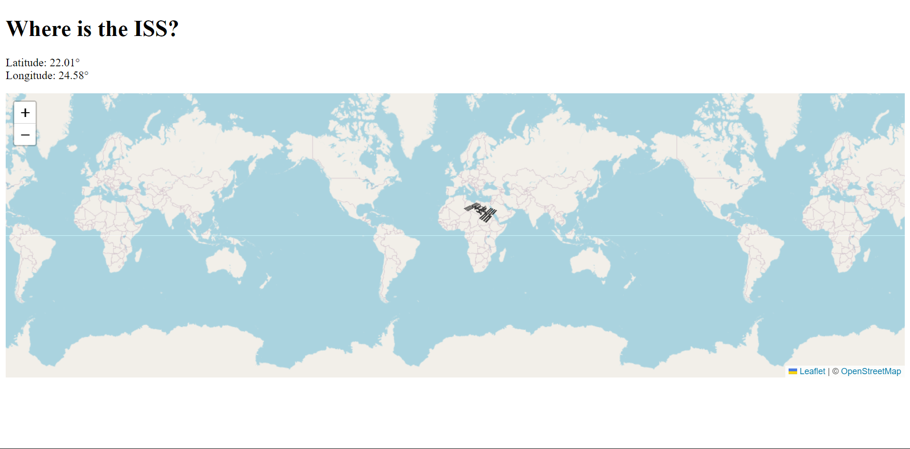

Working with the "whereisiss.at" api to map the location of the iss in real time using leaflet.js

<!-- Added an image of the finished project -->
## This is the final image of the Mapping project using leaflet.js
